# Magnolia Pharma Lakehouse (Azure Databricks)

**New here?** Free Edition → **[docs/FREE_EDITION.md](docs/FREE_EDITION.md)** · Full setup → **[docs/SETUP_FROM_SCRATCH.md](docs/SETUP_FROM_SCRATCH.md)**

Portfolio implementation of a **specialty-pharmacy analytics lakehouse** on Azure Databricks: Medallion layers, Auto Loader ingestion, Structured Streaming, Unity Catalog governance, and an MLflow-governed therapy-discontinuation model.

This mirrors the architecture described in the Magnolia project brief: ADLS Gen2 + Delta Lake + Unity Catalog, Bronze/Silver/Gold products, Photon-friendly incremental pipelines, and HIPAA-oriented access patterns.

## Architecture

```mermaid
flowchart LR
  subgraph sources [Source systems]
    SP[Specialty pharmacy]
    CL[Claims]
    CRM[CRM]
    PA[Prior auth]
    INV[Inventory]
  end

  subgraph adls [ADLS Gen2 landing]
    L1[claims/]
    L2[crm/]
    L3[prior_auth/]
    L4[inventory/]
    L5[specialty_rx/]
  end

  subgraph bronze [Bronze Delta]
    B1[(bronze.*)]
  end

  subgraph silver [Silver Delta]
    S1[(silver.patient_events)]
    S2[(silver.claims_enriched)]
  end

  subgraph gold [Gold Delta]
    G1[(gold.patient_journey)]
    G2[(gold.daily_therapy_metrics)]
  end

  subgraph ml [ML]
    M1[MLflow: discontinuation risk]
  end

  sources --> adls
  adls -->|Auto Loader| bronze
  bronze -->|batch + streaming MERGE| silver
  silver -->|aggregations + journey logic| gold
  gold --> M1
```



## Prerequisites

- Azure Databricks workspace (Premium) with **Unity Catalog**
- ADLS Gen2 storage account and external locations (or use DBFS for local demo)
- Serverless or Photon-enabled cluster / SQL warehouse for bake-offs
- Optional: Microsoft Entra ID groups mapped to UC grants (see `governance/unity_catalog_grants.sql`)

## Quick start

| Step | Action |
|------|--------|
| 1 | [docs/SETUP_FROM_SCRATCH.md](docs/SETUP_FROM_SCRATCH.md) — Path 1 |
| 2 | Run **`notebooks/QUICKSTART_setup_and_run`** in Databricks (Serverless, Run all) |
| 3 | Later: Path 2 in the same doc for full Azure + ADLS |

## Dashboards

Import **`dashboards/*.lvdash.json`** after running notebooks **QUICKSTART** and **08**. See [dashboards/README.md](dashboards/README.md).

## Notebooks (after QUICKSTART)

| Order | Notebook | Purpose |
|------:|----------|---------|
| **—** | **`QUICKSTART_setup_and_run`** | **Start here — full batch pipeline, no Azure** |
| 08 | `08_dashboard_views.py` | SQL views for AI/BI dashboards |
| 00 | `00_setup_unity_catalog.py` | Catalog, schemas, table DDL |
| 01 | `01_bronze_autoloader.py` | Auto Loader from ADLS landing → Bronze Delta |
| 02 | `02_silver_streaming_merge.py` | Structured Streaming + incremental MERGE to Silver |
| 03 | `03_gold_patient_journey.py` | Patient journey + daily therapy metrics (Gold) |
| 04 | `04_performance_tuning.py` | Liquid clustering, broadcast joins, MERGE patterns |
| 05 | `05_ml_discontinuation_risk.py` | Feature table + MLflow training & registration |
| 06 | `06_photon_bakeoff.py` | Template to compare Photon vs. standard Spark |

## Repository layout

```
config/           Environment and path configuration
governance/       UC grants, masking, row filters
notebooks/        Databricks notebooks (Python)
schemas/          DDL reference for Bronze / Silver / Gold
scripts/          Local sample-data generator
src/magnolia/     Shared Spark utilities (MERGE, config loader)
```

## Performance targets (from project brief)

The Gold patient-journey pipeline is structured so you can measure:

- **Before**: monolithic batch (~3 hours in the reference story)
- **After**: incremental MERGE + liquid clustering + selective broadcast (~40 minutes target on comparable volume)

Use `notebooks/04_performance_tuning.py` and `06_photon_bakeoff.py` to document timings in your write-up.

## Governance

- **Unity Catalog** three-level namespace: `{catalog}.bronze|silver|gold`
- **Row/column security**: examples in `governance/unity_catalog_grants.sql` and `governance/column_masking.sql`
- **Tokenization**: Silver layer replaces raw patient/provider IDs with hashed tokens before Gold exposure

## License

MIT — for portfolio and learning use. Synthetic data only; no real PHI.
